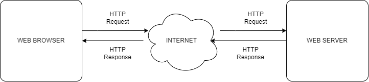
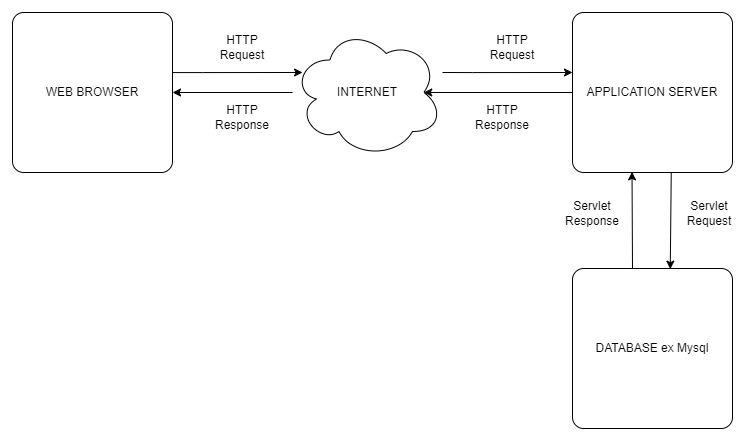
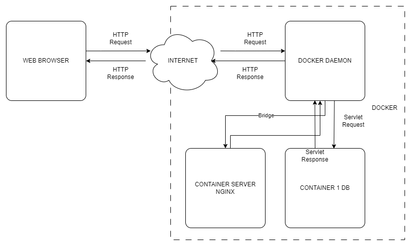

# DAFTAR TUGAS AKAN SAYA TAMPILKAN PADA BAGIAN INI
| TUGAS | FILE |
| ------| -----|
| [TUGAS 1](https://github.com/Reza1290/SysAdmin-3122500024/blob/main/TUGAS1.md) |  _[FILE](https://github.com/Reza1290/SysAdmin-3122500024/blob/main/TUGAS1.md)_ |
| [TUGAS 2](#tugas-2) | _[FILE](https://github.com/Reza1290/SysAdmin-3122500024/blob/main/TUGAS_2/README.md)_ , _[MARP CLICK](TUGAS_2/PPT_SYSADMIN.md)_, _[PDF MARP](TUGAS_2/PPT_SYSADMIN.pdf)_|
| [TUGAS 3](#tugas-3) | _[FILE](https://github.com/Reza1290/SysAdmin-3122500024/blob/main/TUGAS_3/README.md)_|
| [TUGAS 4](#tugas-4) | _[FILE](https://github.com/Reza1290/SysAdmin-3122500024/blob/main/TUGAS_4/README.md)_|
| [TUGAS 5](#tugas-5) | _[FILE](https://github.com/Reza1290/SysAdmin-3122500024/blob/main/TUGAS_5/README.md)_|
| [TUGAS 6](#tugas-6) | _[FILE](https://github.com/Reza1290/SysAdmin-3122500024/blob/main/TUGAS_6/README.md)_|

----

# Web Server and Web Browser Architecture 

Ketika pengguna memasukkan alamat web server ke dalam bilah alamat browser Chrome, browser mengirimkan permintaan HTTP ke alamat yang dituju. Permintaan ini mencakup informasi tentang jenis permintaan yang dibuat (seperti GET atau POST) dan alamat yang diminta, serta header permintaan lainnya. Web server yang dituju menerima permintaan ini di port yang sesuai (biasanya port 80 untuk HTTP dan 443 untuk HTTPS) dan memprosesnya. 

Setelah memproses permintaan, server menghasilkan respons HTTP yang berisi informasi yang diminta, seperti halaman web atau data lainnya, bersama dengan kode status HTTP yang sesuai. Browser Chrome menerima respons ini dan memprosesnya, merender halaman web sesuai dengan HTML, CSS, dan JavaScript yang diterima. Konten yang diterima kemudian ditampilkan kepada pengguna.

## Apa Bedanya Antara Server Aplikasi dan Server Web?
Server aplikasi dan server web memiliki peran yang serupa namun dengan perbedaan tertentu yang perlu dipahami.

Server aplikasi menggunakan lebih dari sekadar protokol HTTP. Mereka bisa bekerja dengan berbagai jenis program selain halaman web. Selain itu, server aplikasi biasanya menawarkan kemampuan tambahan yang memperluas fungsionalitasnya.

Di sisi lain, server web memiliki fungsi utama yang lebih terbatas. Mereka secara khusus menjalankan permintaan HTTP untuk menampilkan halaman web. Meskipun demikian, server web juga bisa menyediakan fitur tambahan seperti penyimpanan sementara dan permintaan dasar.

Situs web dan aplikasi yang menggunakan server aplikasi sering membutuhkan fitur yang tidak disediakan oleh server web biasa. Misalnya, server aplikasi memungkinkan transaksi, personalisasi, dan layanan pesan, yang menjadi semakin penting untuk berbagai jenis situs web.

Tidak jarang server web menjadi bagian dari server aplikasi. Ini karena server web seringkali merupakan komponen penting dari layanan yang disediakan oleh server aplikasi. Ketika seseorang membicarakan server aplikasi, sering kali juga dimaksudkan sebagai server web.

Saat pengguna mengetikkan URL ke dalam browser, server web menyajikan konten yang sama tidak peduli dari mana pengguna tersebut atau perangkat apa yang digunakannya. Meskipun demikian, halaman web dengan komponen adaptif biasanya didukung oleh teknologi lain selain server web.

Dalam pengelolaan situs web, kombinasi antara server web dan server aplikasi seringkali memberikan hasil yang lebih baik. Server web dapat menangani permintaan dasar dan menyediakan konten statis dengan baik, sedangkan server aplikasi lebih cocok untuk menangani permintaan yang lebih kompleks dan dinamis.

Dengan demikian, meskipun server aplikasi dan server web memiliki perbedaan yang signifikan, keduanya memiliki peran yang penting dalam menjaga situs web berjalan dengan baik dan menyediakan pengalaman pengguna yang baik.

## DOCKER / CONTAINERIZED Masuk Mana?

Docker atau containerisasi adalah teknologi yang memungkinkan pengembang untuk mengemas aplikasi dan semua dependensinya ke dalam unit yang disebut container. Dalam konteks server aplikasi dan web, Docker atau containerisasi sering digunakan untuk menyediakan lingkungan yang terisolasi untuk menjalankan aplikasi.

Dalam hubungannya dengan server aplikasi dan web, Docker atau containerisasi masuk dalam kategori yang berbeda dari server aplikasi dan server web. Server aplikasi dan server web adalah infrastruktur yang digunakan untuk menjalankan dan menyajikan aplikasi dan konten web kepada pengguna akhir. Di sisi lain, Docker atau containerisasi adalah teknologi yang digunakan untuk mengemas, mendistribusikan, dan menjalankan aplikasi dan layanan dalam lingkungan terisolasi yang disebut container.

Jadi, Docker atau containerisasi bisa dianggap sebagai teknologi yang dapat digunakan untuk menyediakan lingkungan runtime untuk menjalankan aplikasi di dalam server aplikasi atau server web. Mereka memungkinkan pengembang untuk mengemas dan mendistribusikan aplikasi dengan lebih mudah, serta memastikan konsistensi dalam lingkungan pengembangan, pengujian, dan produksi. Dengan demikian, Docker atau containerisasi memainkan peran penting dalam infrastruktur modern yang memungkinkan pengembangan dan pengiriman aplikasi yang lebih efisien dan dapat diandalkan.

