# DAFTAR TUGAS AKAN SAYA TAMPILKAN PADA BAGIAN INI
| TUGAS | FILE |
| ------| -----|
| [TUGAS 1](https://github.com/Reza1290/SysAdmin-3122500024/blob/main/TUGAS1.md) |  _[FILE](https://github.com/Reza1290/SysAdmin-3122500024/blob/main/TUGAS1.md)_ |
| [TUGAS 2](#tugas-2) | _[FILE](https://github.com/Reza1290/SysAdmin-3122500024/blob/main/TUGAS_2/README.md)_ , _[MARP CLICK](TUGAS_2/PPT_SYSADMIN.md)_, _[PDF MARP](TUGAS_2/PPT_SYSADMIN.pdf)_|
| [TUGAS 3](#tugas-3) | _[FILE](https://github.com/Reza1290/SysAdmin-3122500024/blob/main/TUGAS_3/README.md)_|
| [TUGAS 4](#tugas-4) | _[FILE](https://github.com/Reza1290/SysAdmin-3122500024/blob/main/TUGAS_4/README.md)_|
| [TUGAS 5](#tugas-5) | _[FILE](https://github.com/Reza1290/SysAdmin-3122500024/blob/main/TUGAS_5/README.md)_|
| [TUGAS 6](#tugas-6) | _[FILE](https://github.com/Reza1290/SysAdmin-3122500024/blob/main/TUGAS_6/README.md)_|
| [TUGAS 7](#tugas-6) | _[FILE](https://github.com/Reza1290/SysAdmin-3122500024/blob/main/TUGAS_7/README.md)_|

----

## Daftar Isi
- [A. Web Server and Web Browser Architecture](#a-web-server-and-web-browser-architecture)

- [B. Containerized Web Server Using Docker](#b-containerized-web-server-using-docker) `New `
- [C. Apache2 + Dns Resolver + Docker Uptime Kuma Package](#c-apache2--dns-resolver--docker-uptime-kuma-package) `New `

Disini kita gunakan Docker Labs pada link berikut
https://labs.play-with-docker.com/

# A. Getting Started

Disini kita akan mencoba melakukan running images docker bernama `dockersamples/101-tutorial`, dikarenakan tidak terdapat pada local machine kita maka docker melakukan pull ke https://hub.docker.com untuk mencari images dengan nama tersebut

    docker run -d -p 80:80 dockersamples/101-tutorial

`docker run` berfungsi menjalankan images dengan param nama pada akhir <docker/docker/getting-started:pwd> pwd adalah tags  
`-d` digunakan untuk mode dettach atau dijalankan di background  
`-p` set port specified untuk di forward disini 80:80

# B. Our Application

Pada bab ini kita akan belajar melakukan Build Images dari source code dengan melakukan setting awal membuat sebuah `Dockerfile`, file ini akan dieksekusi saat kita akan melakukan sebuah build images di Docker.

1. Pertama-tama source code dapat diperoleh pada link berikut :
[DownloadZIP](http://ip172-18-0-94-cp0r4piim2rg00ao0lig-80.direct.labs.play-with-docker.com/assets/app.zip)
    or [Zip](app.zip)

    Setelah di download **Drag file zip tersebut** kedalam terminal lab docker. lakukan unzip file dan buat file `Dockerfile`

        unzip app.zip
        cd app
        touch Dockerfile
        vi Dockerfile

    Di dalam `Dockerfile` ketik konfigurasi basic berikut

        FROM node:10-alpine
        WORKDIR /app
        COPY . .
        RUN yarn install --production
        CMD ["node", "/app/src/index.js"]

    `FROM node:10-alpine` adalah images yang digunakan disini menggunakan image nodejs tersedia di [Hub Docker](https://hub.docker.com/layers/library/node/10-alpine/images/sha256-cebde99cf831563626740e22b74d5122aea6124db5c0f50bf56e4fdbf7712df1s)  
    `WORKDIR` Working Directory digunakan sebagai tempat menjalankan perintah ( seperti root dir )  
    `COPY . .` Melakukan Copy file sekarang ke WorkDir  
    `RUN yarn install --production` yarn dijalankan dengan perintah RUN  
    `CMD` Disini merupakan perintah yang dieksekusi diakhir biasanya berisi **starting up a server**

2. Lakukan Build Images

        docker build -t docker-101 .

    `build` Build images diikuti  
    `-t` tags dari images default latest/terbaru  
    `.` mengacu pada direktori sekarang pastikan mengandung `Dockerfile`

    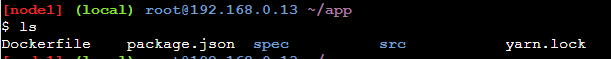

    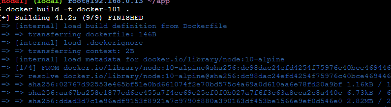

3. Run Images yang telah kita buat

        docker run -d -p 3000:3000 docker-101

    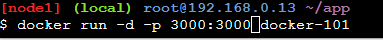

    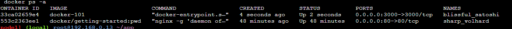

    Kita cek pada link labs

    
    
Dengan demikian kita telah membuat sebuah aplikasi yang berjalan diatas docker container bisa kita lihat saat saya melakukan `Docker ps -a` terdapat 2 container berjalan dengan port berbeda.

Jika kita tidak menggunakan container bisa jadi aplikasi dengan pengunaan Package Manager yang sama misal NodeJs, dapat terjadi mixed version. atau rancu.

# C. Updating Our App

Disini kita akan mencoba mengedit source file dari `App` kita yang sudah dijalankan pada Container, contoh disini kita ubah pada file `app.js`

1. Buka /app/src/static/js/app.js gunakan editor dari labs

2. Build ulang Images karena kita melakukan perubahan pada source

        docker build -t docker-101 .

    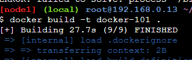

3. Jalankan Images Lagi ( Akan Error karena terdapat instance dengan port yang sama sedang dijalankan )

        docker run -dp 3000:3000 docker-101

    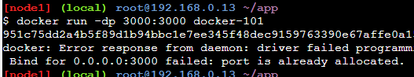

4. Stop terlebih dahulu container dengan port `3000` kemudian hapus

        docker stop nama_container/id & docker rm nama_container/id

    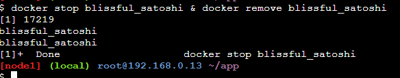

5. jalankan ulang

        docker run -dp 3000:3000 docker-101

    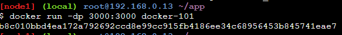

    Sudah berubah

    

    dan datanya hilang karena kita jalankan ulang! looks like factory mode

# D. Sharing our App

Seperti github `Docker` memiliki Repositorynya sendiri seperti pada step pertama dilakukan pulling dari Docker Repo yang bernama `Hub Docker` https://hub.docker.com/

1. Buat Repository pada Hub Docker dengan nama repo `101-todo-app`

    

2. Push images dari Local ke dalam Docker HUB

        docker push reza1290/101-todo-app

    

    diatas seharusnya file tidak ditemukan karena tidak ditemukan

    

3. Login Ke akun kita untuk push

    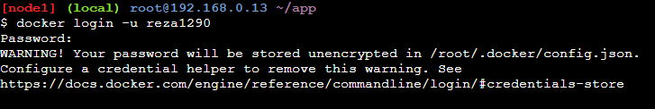

4. Kita tag images tersebut ke reza1290/101-todo-app

        docker tag docker-101 reza1290/101-todo-app

    

5. Push tagged images

        docker push reza1290/101-todo-app

    

6. Berhasil

    

7. buat Instance baru dari Os labs

    

    1. Run Images, ambil dari Hub karena tidak ada di lokal

            docker run -dp 3000:3000 rez1290/101-todo-app

        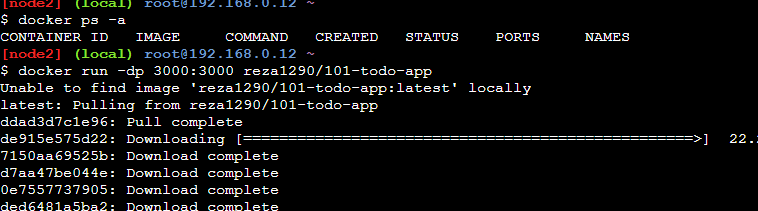

        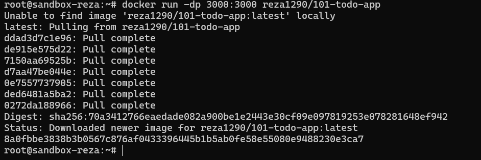

        

Karena docker playground penuh sizenya saya pakai VPS saja :"

# E. Presisting Our DB

Kita tahu bahwa saat kita menghentikan/menghapus container data yang tersimpan pada container akan ikut hilang nah disini kita akan melakukan `presisting data`

Kita buat 2 container 

**Container Pertama**
1. buat sebuah Container dengan OS ubuntu dan buat sebuah file bernama file.txt yang melakukan generate random angka dari 1 hingga 10000

        docker run -d ubuntu bash -c "shuf -i 1-10000 -n 1 -o /data.txt && tail -f /dev/null"

    bash digunakan untuk melakukan eksekusi bash terminal didalam container.

    

2. Ekseskusi perintah cat

        docker exec id cat /data.txt

    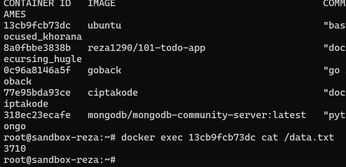

3. Run container lain

        docker run -it ubuntu ls /

    

    disini tidak ada file data.txt karena kita tahu sendiri container ini berbeda

    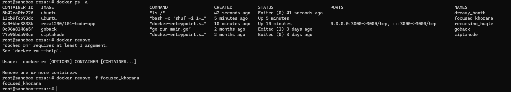

Secara default todo-app menyimpan pada sqlite database

kita lakukn mounting database ke app dengan membuat sebuah volume 

1. Buat volume 

        docker volume create todo-db

    

2. jalankan todo container dengan mounting volume yang kita buat

        docker run -dp 3000:3000 -v todo-db:/etc/todos docker-101

    disini saya pull dari hub saya

    

3. tambahakan beberapa data seblum di hapus container

    

4. Remove container

    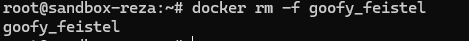

5. Start lagi! dan seharusnya data masih ada

    

6. setelah di hapus sebelumnya masih ada datanya

    

7. docker menyimpannya dalam sebuah directory

    

# F. Using Bind Mounts
