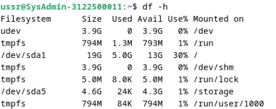
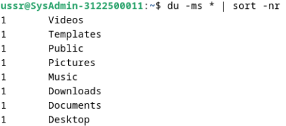
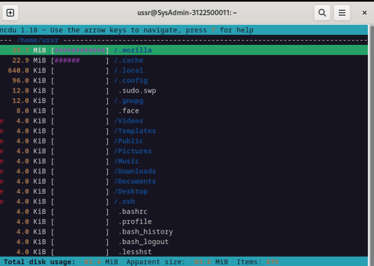
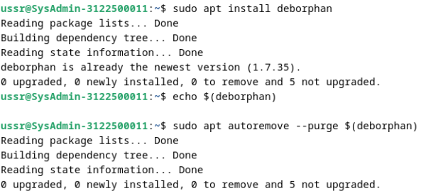

# FILE LAINNYA

[BACK](../README.md)

# TUGAS 3

## LINUX APT COMMAND 

### FOR USER

|Command | Description |
|--------|:------------|
|``apt show foo``| Menampilkan informasi paket foo|
|``apt search foo``| Mencari paket bernama/berkaitan foo|
|``apt-cache policy foo``| Menampilkan versi tersedia paket foo|

### Command apt untuk ADMINISTRATOR

__Pastikan__ menggunakan ``sudo`` untuk menjalankan perintah berikut (root)

|Command | Description |
|--------|:------------|
|``apt update``| Update repository metadata (list versi dll)|
|``apt install foo``| Memasang paket foo dan yang terkait|
|``apt upgrade``| Menghapus versi lama paket|
|``apt full-upgrade``| Mengupdate/hapus paket yang beneran terbaru|
|``apt remove foo``| menghapus paket foo, tidak confignya|

### HOW TO USE APT COMMAND

Mengubah Repository Apt (pastikan gunakan sudo)

setelah melakukan update dan upgrade untuk depedency

Kita bisa install aplikasi menggunakan Aplikasi Software Bawaan

atau menggunakan KDE Installer, 

Informasi lengkap tentang Package Bisa diakses melalui link berikut :
[kde-full](https://wiki.debian.org/KDE#KDE.27s_software_in_Debian)

### Melihat Storage Yang terpakai di Linux Menggunakan TERMINAL

### Membuat daftar Directory, diurutkan dari yang terbesar ke yang terkecil
Melihat isi direktori dengan perintah du dan sort (satuan megabyte):

### NCurses Disk Usage (ncdu)
Untuk menganalisis ruang disk dalam mode konsol dengan menggunakan perintah ncdu.

### baobab
Digunakan untuk menganalisa ruang pada disk dengan tampilan grafis.

### Membersihkan Paket
#### Apt/aptitude/dpkg 
 Manajer paket Debian yang biasa digunakan. Saat menginstal sebuah paket, file sumber arsip/debnya disimpan di sistem pada folder /var/cache/apt/archives/ untuk memungkinkan kemungkinan instalasi ulang tanpa koneksi Internet. 
 
 Untuk membersihkan cache apt gunakan perintah apt clean.

Setelah cache dari paket yang diinstal dibersihkan, Kita juga dapat menghapus paket yang tidak berguna dari sistem, serta file konfigurasi. Peringatan! Ingatlah untuk memeriksa dengan cermat daftar paket yang direncanakan untuk dihapus, sebelum menerima operasi:

Jika Anda telah mengupgrade sistem Anda, ada kemungkinan beberapa paket tidak lagi tersedia di repositori baru (paket tersebut sudah usang). Untuk membuat daftar dan menghapus paket-paket ini, gunakan apt dan periksa dengan cermat daftar paket yang direncanakan untuk dihapus:

### 
Terakhir, untuk membuat daftar dan membersihkan file konfigurasi yang tetap ada meskipun aplikasi telah dihapus, gunakan perintah berikut :

#### deborphan 
Mencantumkan paket-paket yang diadopsi pada sistem : paket-paket yang tidak bergantung pada paket lain. 

Ingatlah untuk memeriksa dengan cermat daftar paket yang direncanakan untuk dihapus, sebelum menjalankan operasi.

### Mengosongkan trash-bin
Tiga trash-bin (wastebasket) yang berbeda harus dipertimbangkan:

#### trash-bin user
Anda dapat mengosongkannya dengan system file manager atau dengan perintah :

#### trash-bin admin
Untuk mengosongkannya dengan cara yang benar, gunakan terminal dalam mode administrator:

#### trash-bin eksternal
biasanya diberi nama '/media/(loginname)/your_disk/.Trash_1000'.

## Menginstall Package EXTERNAL Extensi .deb

#### DEBI Application

Kita dapat menginstall package External (.deb) menggunakan aplikasi Gdebi yang dapat diinstall dengan cara berikut.

