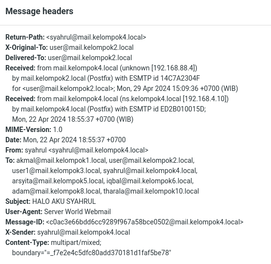

# DAFTAR TUGAS AKAN SAYA TAMPILKAN PADA BAGIAN INI
| TUGAS | FILE |
| ------| -----|
| [TUGAS 1](https://github.com/Reza1290/SysAdmin-3122500024/blob/main/TUGAS1.md) |  _[FILE](https://github.com/Reza1290/SysAdmin-3122500024/blob/main/TUGAS1.md)_ |
| [TUGAS 2](#tugas-2) | _[FILE](https://github.com/Reza1290/SysAdmin-3122500024/blob/main/TUGAS_2/README.md)_ , _[MARP CLICK](TUGAS_2/PPT_SYSADMIN.md)_, _[PDF MARP](TUGAS_2/PPT_SYSADMIN.pdf)_|
| [TUGAS 3](#tugas-3) | _[FILE](https://github.com/Reza1290/SysAdmin-3122500024/blob/main/TUGAS_3/README.md)_|
| [TUGAS 4](#tugas-4) | _[FILE](https://github.com/Reza1290/SysAdmin-3122500024/blob/main/TUGAS_4/README.md)_|
| [TUGAS 5](#tugas-5) | _[FILE](https://github.com/Reza1290/SysAdmin-3122500024/blob/main/TUGAS_5/README.md)_|

----


# MAIL SERVER DEBIAN 10, BIND9, POSTFIX, DOVECOT, Client Evolution, RoundCube.

### Daftar Isi
- [A. Persiapan](#a-persiapan)
- [B. Setup NTP Server](#b-setup-ntp--network-time-protocol)
- [C. Install WebServer Apache2](#c-install-web-server--apache2--php-fm)
- [D. Install Database Server MariaDb](#d-install-database-server--mariadb-server)
- [E. Install SMTP Sever Postfix](#e-install-postfix-mailserver-smtp-server)
- [F. Install IMAP POP3 Doveco (telnet)](#f-install-dovecot-imap-pop3)
- [G. Testing Dengan Debian Evolution](#g-debian-evolution)
- [H. RoundCube Email Client](#h-roundcube)
###### Tambahan
- [I. MailServer JARKOM C307 (Network)](#i-percobaan-mailserver-jaringan-jarkom-c307)
###### Tambahan Minggu 10
- [J. Analisis Header Pada Email](#i-analisis-header-email)

### A. Persiapan

1. Setup terlebih dahulu mail server pada konfigurasi zone sehingga dapat di resolve ```mail.kelompok2.local```

    > 
    > forward

    >
    > inverse

2. nslookup

    > 


### B. Setup NTP ( Network Time Protocol )

1. Installasi Paket dengan command ``sudo apt install systemd-timesyncd``

2. Ubah TimeZone ke Asia/Jakarta

3. Buat RTC menjadi sama dengan UTC

4. Aktifkan NTP supaya waktu Sinkron

    > 

5. Ubah config file ``timesync.d``, buat pool ke terdekat supaya delay jadi pendek.

    > 

    > List NTP Indonesia https://www.ntppool.org/zone/id

6. Restart Service yang berjalan dan cek statusnya

    > 

7. Cek Tanggal

    > 

### C. Install Web Server ( APACHE2 + PHP-FM )

#### +  Install Apache2
1. Install paket dengan command berikut ``sudo apt -y install apache2``

    > 


2. Ubah ServerToken Menjadi Prod gunakan Text Editor seperti Nano

    > 
    > sudo nano /etc/apache2/conf-enabled/security.conf

3. Tambahkan Directory yang dapat diakses

    > 
    > sudo nano /etc/apache2/mods-enabled/dir.conf

4. Tambahkan ServerName

    > 
    > sudo nano /etc/apache2/apache2.conf

5. Webmaster email

    > 
    > sudo nano /etc/apache2/sites-enabled/000-default.conf

6. Reload service apache2

    > 

7. Cek apakah webserver berjalan pada browser kita

    > 

#### + Install PHP 8.2

1. Install dengan perintah berikut

    > 
    > sudo apt -y install php8.2 php8.2-mbstring php-pear

2. Cek apakah sudah terinstall

    > 

3. Buat sebuah file php untuk memeriksa apakah PHP Berjalan/Fungsi

    > 

4. Jalankan

    > 


#### + Install PHP FM

1. Install dengan perintah berikut

    > 

2. Lakukan Konfigurasi pada file apache untuk PHP-FM

    > 
    > sudo nano /etc/apache2/sites-available/default-ssl.conf

3. setenvif pada ae2enmod proxy_fcgi
4. load config

    > 

5. Jalankan ulang Servicenya 

    > 

6. Test kedalam webserver, buat file info.php

    > 
    > sudo echo '<?php phpinfo(); ?>' > /var/www/html/info.php

7. cek pada web

    > .png>)
    > berhasil


### D. Install Database server ( Mariadb-Server )

1. Install paket dengan perintah berikut

    > 
    > sudo apt -y install mariadb-server

2. Pastikan atau ubah charset ke utf8mb4, lalu restart service mariadb

    > 
    > sudo nano /etc/mysql/mariadb.conf.d/50-server.cnf

3. Lakukan installasi dengan perintah ``sudo mysql_secure_installation``

    > 

    Installasi pattern

    
       Enter current password for root (enter for none): Tekan Enter

       Switch to unix_socket authentication [Y/n] n

       Change the root password? [Y/n] n

       Remove anonymous users? [Y/n] y

       Disallow root login remotely? [Y/n] y

       Remove test database and access to it? [Y/n] y

       Reload privilege tables now? [Y/n] y

    Pastikan sama sehingga langkah tetap sama.

4. Masuk kedalam mysql perintah    `mysql`

    > 

5. Cek akses user root

    > 

6. Cek daftar user pada database user

    > 

7. Lihat semua database

    > 

8. Berarti mysql sudah terinstall, coba buat sebuah dummy database dan table untuk menjalankan beberapa query crud

    > 

9. Berhasil dan Database mariadb sudah terinstall.


#### E. Install POSTFIX mailserver (SMTP Server)

1. Install dengan perintah ``sudo nano apt -y install postfix sasl2-bin``
2. Pilih yang No Configuration ( kita config manual )
    > .png>)

3. Copy file config /usr/share/postfix/main.cf.dist ke /etc/postfix/main.cf

    > 

4. Ubah beberapa Konfigurasi pada file postfix main.cf

    > .png>)
    > .png>)
    > .png>)
    > .png>)
    > .png>)
    > .png>)
    > .png>)
    > .png>)
    > .png>)
    > .png>)
    > .png>)

5. Tambahkan config anti spam
    > .png>)
    > sudo newaliases


### F. Install DOVECOT (IMAP POP3)

1. Gunakan Perintah berikut untuk installasi `sudo  apt -y install dovecot-core dovecot-pop3d dovecot-imapd`

    > 


2. Ubah listen IP
    > .png>)

3. Setting file auth   

    > .png>)

4. Konfigurasi file mail

    > .png>)

5. Terakhir tambahkan mode 0666, dan user,group postfix pada file master

    > .png>)

6. Restart service, dan cek di netstat

    > .png>)


Setelah beberapa paket terinstall seperti imap, pop3 kita akan coba melakukan test connection ke postfix

1. dengan perintah `telnet mail.kelompok2.local`

    > 

2. Coba test kirim ke user reza

    > 

### G. DEBIAN EVOLUTION

1. Buat User Terlebih dahulu disini kita buat user default kita di saya yaitu
``user``

    > Identitiy
    > 

    > Recieve
    > 

    > Sending ( Port 25 )
    > 

2. user telah dibuat sekarang buat user lagi (dummy) untuk saya, ``reza`` dengan langkah yang sama. adduser terlebih dahulu
    > .png>)

3. Mengirim pesan

    > 

4. cek Inbox user `reza`

    > 

    terdapat email dari user dan budi yang kita lakukan di telnet tadi!.
    berhasil!.


### H. ROUNDCUBE

1. Sebelum itu kita perlu melakukan Konfigurasi untuk user roundcube, tambahkan pada tabel db user

    > 

2. Berikan full access

    > 
    
    Load
    > 

3. Install Roundcube paket dengan perintah berikut

    > 

4. Pilih Yes
    > 

5. Masukkan password tadi ( 123 )

    > 

6. Lakukan config pada file `/etc/roundcube/config.inc.php`

7. Samakan dengan config berikut
    > 
8. Kemudian konfigurasi file apache pada roundcube, uncomment line 3 dan hapus public_html path

    > 

9. pada apache2 default conf tambahkan Servername untuk mail dan document root menjadi roundcube ``sudo nano /etc/apache2/sites-available/000-default.conf``, Servername mail.kelompok2.local DocumentRoot /var/lib/roundcube/
    
    > 

10. jalankan rekonfigurasi seperti berikut

    > 
    
    Ok

    > 

    en_Us

    > 

    Pilih Install ulang ( YES 
    
    > 

    Pilih TCP IP

    > 

    Pilih localhost

    > 

    Port 3306

    > 

    Pilih native password

    > 

    Database name default

    > 

    Username default

    > 

    Password 123

    > 

    Admin root

    > 

    Pilih webserver apache2

    > 

    Restart dan keep curently installed

11. Roundcube terinstall

    > 

12. Login dengan user debian kita saya user > user, bisa kita lihat config evolution sudah terload pada roundcube saya

    > 

13. Coba mengirim dari user ke Reza

    > 

14. Login sebagai user `reza`

    > 
    Email diterima

### I. PERCOBAAN MAILSERVER JARINGAN JARKOM C307 


1. Pastikan sudah terhubung dengan Ethernet Pada LAB JARKOM

    > 
2. Lakukan Ping ke 1.1.1.1 pastikan sudah terhubung ke dns 1.1.1.1
    > 

3. Setting Virtual Box Ke Dalam **Network Bridge**

    > settings/machine > Network 
    >
    > 

4. Supaya DNS Kita dapat diresolve oleh kelompok lain lakukan Konfigurasi Berikut

    > **Setting interfaces**
    >
    > 
    >sudo nano /etc/network/interfaces

    > **Setting named.conf**
    >
    > 
    > sudo nano /etc/bind/named.conf.options

    > **Setting resolv.conf**
    >
    > 
    > sudo nano /etc/resolv.conf


    Lakukan *sudo restart systemctl networking* Setelahnya

5. Lakukan Ping Detik.com atau IP Kelompok lain disini 192.168.10.10

    > 

6. Buat DHCP Server Bridge Pada Aplikasi WINBOX

    >   Connect Ke Server/Router Klik DHCP SETUP, Pilih Bridge Interface
    >
    >   

    >   Next (Default)
    >
    > 
    > 
    > 
    >  Masukkan dns
    > 
    > Default
    > 

    >   

7. Cek Mail Server

    > 
    > nslookup -q=MX kelompok2.local

8. Buka Mail Server Kelompok Kita

    > Lakukan Pengiriman Ke Kelompok Lainnya
    >
    > 


### J. Analisis Header Email


1. Message Header Pada Email dengan attachment IMAGE

    

    >**Return-Path** adalah alamat email yang digunakan untuk mengirim balik pesan jika terjadi kesalahan pengiriman.

    Dalam kasus ini, alamatnya adalah syahrul@mail.kelompok4.local.

    > **X-Original-To dan Delivered-To** adalah alamat email tujuan asli dan alamat email tujuan akhir. 
    
    Keduanya adalah user@mail.kelompok2.local.


    >**Received** adalah catatan dari setiap server mail yang telah dilewati pesan ini. 
    
    Dalam kasus ini, pesan ini diterima dari mail.kelompok4.local oleh mail.kelompok2.local.

    >**MIME-Version** adalah versi dari MIME yang digunakan dalam pesan ini. 
    
    Dalam kasus ini, versinya adalah 1.0.
    
    >**Date** adalah tanggal dan waktu ketika pesan ini dikirim. 
    
    Dalam kasus ini, pesan ini dikirim pada Senin, 22 April 2024 pukul 18:55:37 WIB.

    >**From** adalah pengirim pesan. 
    
    Dalam kasus ini, pengirimnya adalah syahrul@mail.kelompok4.local.

    >**To** adalah penerima pesan. 
    
    Dalam kasus ini, penerimanya adalah beberapa alamat email.

    >**Subject** Ini adalah subjek atau topik dari pesan. 
    
    Dalam kasus ini, subjeknya adalah “HALO AKU SYAHRUL”.

    >**User-Agent** adalah aplikasi yang digunakan untuk mengirim pesan. 
    
    Dalam kasus ini, aplikasinya adalah Server World Webmail.

    >**Message-ID** adalah ID unik dari pesan ini. 
    
    Dalam kasus ini, ID pesannya adalah **c0ac3e66bdd6cc9289f967a58bce0502@mail.kelompok4.local.**

    >**X-Sender** adalah alamat email pengirim asli. 
    
    Dalam kasus ini, alamatnya adalah syahrul@mail.kelompok4.local.

    >**Content-Type** adalah tipe konten dari pesan ini. 
    
    Dalam kasus ini, tipe kontennya adalah multipart/mixed, yang berarti pesan ini mengandung beberapa bagian dengan tipe konten yang berbeda. “boundary” adalah string yang digunakan untuk memisahkan setiap bagian.

    #### Lalu Apa Itu multipart/mixed ?

    Dalam konteks email, `multipart/mixed` adalah jenis `Content-Type` yang digunakan ketika sebuah pesan email terdiri dari beberapa bagian dengan tipe data yang berbeda. Setiap bagian dalam pesan ini dipisahkan oleh sebuah batas (boundary), yang merupakan string teks.

    Misalnya, jika sebuah email memiliki lampiran, maka `Content-Type`-nya adalah `multipart/mixed`. Dalam kasus ini, teks pesan dan setiap lampiran menjadi bagian terpisah dari konten pesan, masing-masing dengan `Content-Type`-nya sendiri. Jika tidak ada lampiran, `Content-Type` pesan adalah `Text/Plain`, dan tubuh pesan hanya terdiri dari satu bagian.

    Secara umum, `multipart/mixed` digunakan untuk menggabungkan beberapa format data ke dalam satu pesan. Misalnya, sebuah pesan email dapat berisi teks, gambar, dan dokumen lainnya, masing-masing sebagai bagian terpisah dalam pesan yang sama.
